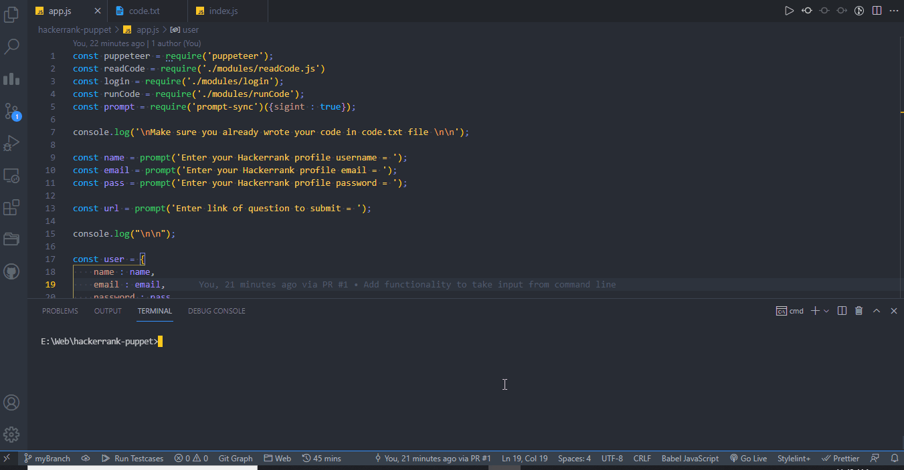
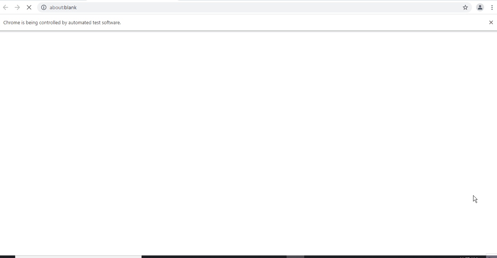

# Puppet Description
A puppet which **lets you automate the process of running and submitting your code of Hackeerank Problems.** No need to leave code editor to run and submit your solution, leave that to our Puppet. The puppet takes your credentials and link to problem using command line and then does all the rest by itself (given crediants and link were correct).

# Demo

Give Input using CMD :

Puppet takes care of rest :

# Technologies Used

**[Node.js](https://nodejs.org/en/) + [Puppeteer](https://pptr.dev/)**

# Run Project Locally

Assumes local installation of [Node.js](https://nodejs.org/en/)

To run the project locally :

* Fork and Clone this repository.
* `cd hackerrank-puppet` to go to the repository.
* Run `npm install` to install all the dependencies
* Write your code in `./code.txt` file for the problem you want to run the script on.
* Run `node app.js` to run the puppet.
* Enter your Hackerrank credentials and link for the respective question and wait for puppet to do the rest.

## THE END :)